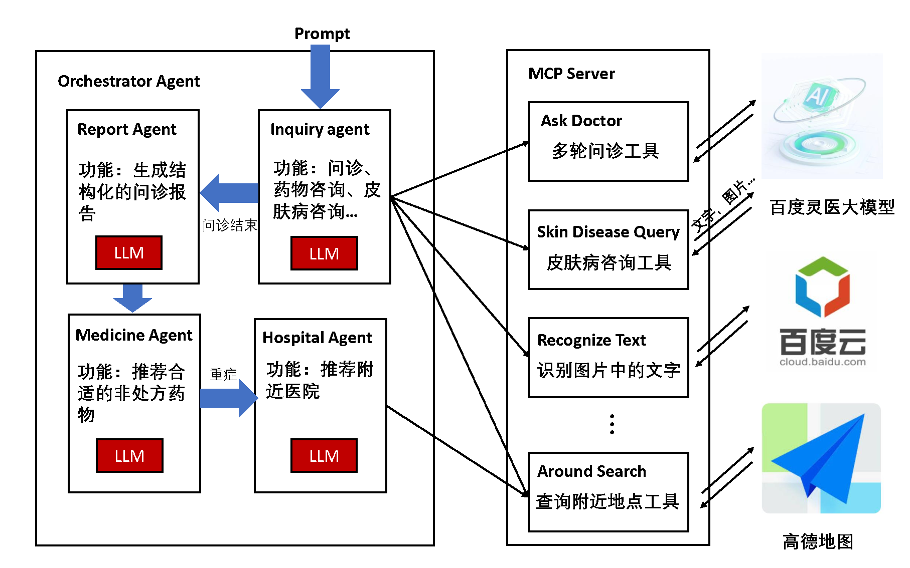
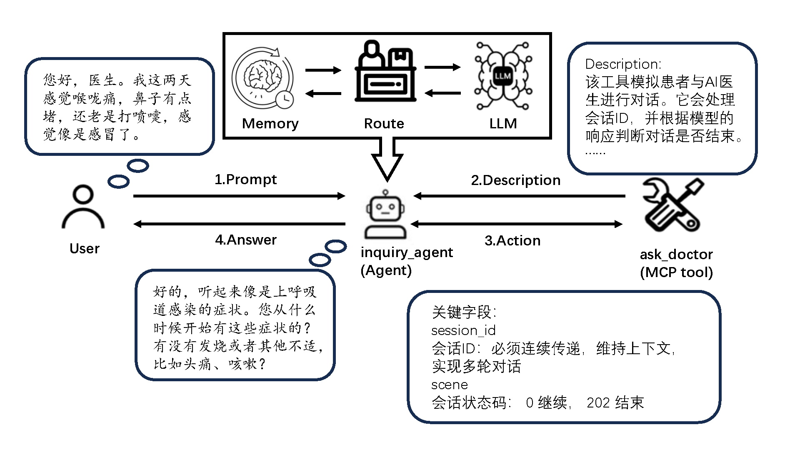

# 医疗问诊系统

一个基于 Python 的 AI 驱动医疗问诊系统，支持多轮对话、报告生成和推荐服务。

## 项目概述

本项目集成了多个 AI 代理，提供完整的医疗问诊流程。支持多轮对话进行诊断，生成可打印的 HTML 报告，推荐药物，并根据用户输入建议附近医院。系统利用外部 API 实现 OCR、医疗问诊和医院推荐功能。

## 功能特性

- **多轮对话**：模拟患者与医生的交互，确保诊断准确。
- **报告生成**：生成统一样式的可打印 HTML5 医疗报告。
- **药物推荐**：根据诊断推荐最多三种药物。
- **医院推荐**：通过地图工具推荐附近医院。
- **OCR 集成**：使用百度 OCR API 识别图片中的文字（如药品包装）。

## 系统架构

系统通过一个编排代理（Orchestrator Agent）协调四个子代理：
1. **问诊代理**：处理多轮医疗问诊。
2. **报告代理**：生成 HTML5 医疗报告。
3. **药物代理**：推荐药物。
4. **医院代理**：建议附近医院。

## 工作流程

工作流程包括：
1. 通过多轮对话收集患者症状。
2. 对话结束后生成诊断报告。
3. 根据诊断推荐药物。
4. 若病情需要，推荐附近医院。

## 依赖项

- Python 3.8+
- 库：`requests`、`google-adk`、`lite-llm`、`python-dotenv`
- 外部 API：百度 OCR API、医疗问诊 API、地图 API

## 注意事项

- 确保正确配置 API 密钥（`API_KEY`、`SECRET_KEY`、`ak`、`sk`）。
- 系统需连接外部 API 以实现完整功能。
